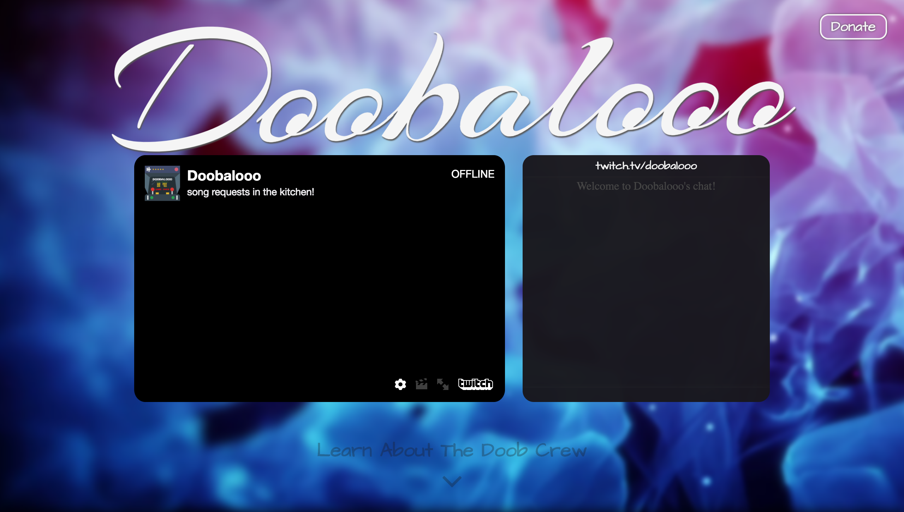

<h1 align="center">The Doobalooo Website</h1>

**A website for [twitch.tv/doobalooo](http://twitch.tv/doobalooo)**

This readme serves to provide reference to the tools used for this project.

<h2 align="center">Tools</h2>

### Frameworks

+ [React.JS](http://reactjs.com/) : *Frond-End Javascript library*
+ [Node.JS](https://nodejs.org/en/) : *Back-End Javascript library*

### Development Tools

+ Babel
  + babel-core
  + babel-loader
  + babel-preset-env
  + babel-preset-react
+ Sass
  + node-sass
+ Webpack
  + style-loader
  + css-loader
+ Webpack Dev Server

### Webpack Loaders

+ [babel-loader](https://github.com/babel/babel-loader) : *loads [Babel](https://babeljs.io) compiler*
+ [class-to-classname](https://github.com/VoidCanvas/class-to-classname) : *converts the JSX tag \"className\" to \"class\"*
+ [style-loader](https://github.com/webpack-contrib/style-loader) : *loads CSS code into React as a final HTML \<style\> tag*
+ [css-loader](https://github.com/webpack-contrib/css-loader) : *loads CSS \@import and url() statements; used together with style-loader*
+ [sass-loader](https://github.com/webpack-contrib/sass-loader) *loads the SASS compiler and supports SCSS files*
  + [node-sass](https://github.com/sass/node-sass) : *peer-dependency of sass-loader*

<h2 align="center">Development Environment</h2>

+ MacOS Sierra 10.12.4
+ [Atom.io](https://atom.io) Editor
+ [Chrome Browser](https://chrome.google.com) & Safari
+ Private [BitBucket](http://bitbucket.org/) Repository
